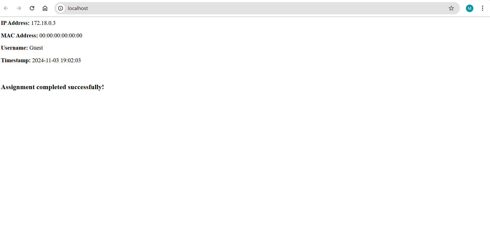
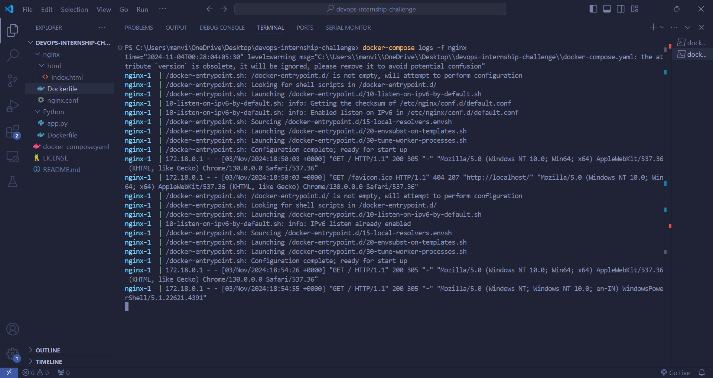

# Dockerized Web Application with Nginx and Flask

### OVERVIEW
This project showcases a Dockerized web application using Nginx as a reverse proxy to a Flask backend. The application retrieves and displays user information such as IP address, MAC address, username, and a timestamp.

### TECHNOLOGIES USED
- **Docker**: Containerization platform
- **Docker Compose**: Multi-container Docker application management
- **Nginx**: Web server and reverse proxy
- **Flask**: Python web framework

### PROJECT STRUCTURE
  ```bash
  /
  ├── nginx
  │   ├── Dockerfile
  │   └── nginx.conf
  ├── python
  │   ├── app.py
  │   └── Dockerfile
  ├── images
  │   ├── application.png
  │   └── logs.png
  └── docker-compose.yaml
  ```

### SETUP INSTRUCTIONS

1. **Clone the Repository**:
   ```bash
   git clone <repository-url>
   cd <repository-directory>

2. **Build and Run the Application**:
   ```bash
   docker-compose up --build

3. **Access the Application**:
Open your web browser and navigate to http://localhost to see the application in action.

### SCREENSHOTS
1. **Application Running in the Browser**
   
2. **Nginx Access Logs** 
   

### PROJECT REPORT
For a detailed report including issues identified and resolution steps, please refer to the [Project Report](https://drive.google.com/file/d/1QhGCNXa2M01b2DD0z8_cbnSPDfKo82v6/view?usp=drive_link).